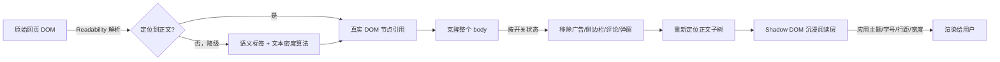

<div align="center">

# 🌿 缓读

### 把任意网页调成适合你的阅读节奏

**无干扰阅读模式 · ADHD 友好设计 · Chrome 浏览器插件**


</div>

---

## ✨ 这是什么

网页正文常常被广告、侧边栏、评论区、弹窗淹没——对注意力容易分散的读者来说，这种视觉噪音会显著打断阅读节奏。

**缓读** 是一个 Chrome 浏览器插件：一键把任意网页转换成干净、专注、可自定义的沉浸阅读层，**不修改原网页 DOM，随时可恢复**。

<table>
<tr>
<td width="50%">

### 🎯 核心理念

- 正文在哪，交给 **Readability.js** 智能定位
- 干扰元素清不清，**你说了算**（4 类独立开关）
- 阅读层与原页面**完全隔离**，不会搞坏任何网站布局

</td>
<td width="50%">

### 🧩 设计取舍

- 不做"暴力隐藏兄弟元素"，避免 grid/flex 布局跑位
- 不做"AI 全权代打"，保留用户对降噪粒度的控制权
- 核心阅读功能纯本地处理，断网可用；AI 摘要是可选的增值功能，默认关闭，开启后才会将正文发给后端

</td>
</tr>
</table>

---

## 🚀 功能一览

| 功能 | 说明 |
|---|---|
| 🧠 **智能正文定位** | Readability.js 优先定位，失败时自动降级到语义标签 + 文本密度算法 |
| 🧹 **动态降噪** | 广告 / 侧边栏导航 / 评论区 / 弹窗横幅 / 会员推销，五类干扰元素独立开关 |
| 🎨 **主题切换** | 温和 · 专注 · 自定义配色，三种阅读氛围 |
| 🔠 **排版微调** | 字号 14–28px、行间距、字间距均可无级调节 |
| 📏 **内容宽度** | 宽版 900px / 窄版 640px，适配不同阅读习惯 |
| ⏱️ **阅读进度** | 顶部进度条 + 剩余阅读时间估算（中英文分别按字符/单词计速） |
| 🤖 **AI 摘要** | 可选开启，正文经后端代理生成 3-5 条要点摘要，默认关闭 |
| 🛡️ **零污染渲染** | Shadow DOM 全屏浮层展示，原网页 DOM 全程不被修改 |
| ↩️ **一键恢复** | 随时退出阅读模式，页面瞬间还原 |

---

## 📦 安装方式

> 当前为开发阶段，尚未上架 Chrome 应用商店，需手动加载。

```bash
git clone git@github.com:ucal9/ADHD.git
```

1. 打开 Chrome，访问 `chrome://extensions`
2. 打开右上角 **开发者模式**
3. 点击 **加载已解压的扩展程序**，选择克隆下来的 `huandu-extension` 目录
4. 打开任意网页，点击工具栏里的缓读图标 🌿，或点击弹出页的「打开阅读面板」

> ⚠️ Chrome 内置页面（如 `chrome://extensions` 本身）出于安全策略，任何插件都无法在其上注入内容脚本，这是预期行为。

---

## 🖼️ 本地预览 Demo

不想安装插件也能看效果：

```bash
open demo.html
```

`demo.html` 内置了一个模拟的假新闻站点 + 一层 `chrome.*` API mock，`content.js` 无需修改即可在纯浏览器环境下运行，方便快速调试。

---

## 🏗️ 技术架构

```
huandu-extension/
├── manifest.json          # Chrome 扩展入口配置（MV3）
├── demo.html              # 独立测试页，模拟 chrome.* API
├── icons/                 # 插件图标
├── vendor/
│   └── readability.js     # Mozilla Readability.js v0.5.0
├── src/
│   ├── content.js         # 顶层编排：串联各模块，处理插件消息与初始化
│   ├── background.js      # service worker（当前为空壳，预留扩展）
│   ├── popup.html / .js   # 工具栏入口页
│   └── modules/
│       ├── prefs-store.js      # 偏好存取（chrome.storage.sync）
│       ├── article-locator.js  # 正文定位（Readability + 降级算法）
│       ├── noise-filter.js     # 降噪清理规则
│       ├── dom-path.js         # 克隆体节点重定位工具
│       ├── reading-stats.js    # 阅读时长估算 / 滚动进度
│       ├── ai-client.js        # 调用后端 AI 摘要代理
│       ├── reader-layer.js     # Shadow DOM 沉浸阅读层渲染
│       └── panel-ui.js         # 设置面板渲染
└── backend/                # FastAPI 后端（仅承载 AI 摘要代理，纯增值，不影响核心离线阅读）
    ├── main.py
    ├── routers/ai.py       # POST /v1/ai/summarize
    ├── services/llm_client.py
    └── ratelimit.py        # 按 device_id 的内存限流
```

**核心链路（前端，完全离线可用）：**



| 模块 | 技术选型 |
|---|---|
| 正文抽取 | [Mozilla Readability.js](https://github.com/mozilla/readability) v0.5.0（MIT） |
| 降噪清理 | 自研 CSS 选择器规则组，作用于 body 克隆体 |
| 样式隔离 | Shadow DOM（`:host { all: initial; }`） |
| 数据持久化 | `chrome.storage.sync`，跨设备同步用户偏好 |
| AI 摘要 | 后端代理调用 LLM API，前端不持有密钥（详见下节） |

**核心逻辑一：正文定位**

```
findArticleRoot():
  result ← findArticleRootViaReadability()   // 优先：Readability 辅助定位
  if result found: return result
  return pickBestCandidate()                  // 降级路径

findArticleRootViaReadability():
  clone ← document.cloneNode(true)             // parse() 会改写文档，必须传克隆体
  parsed ← new Readability(clone).parse()
  若解析失败或无内容 → return null
  取 parsed.content 的前 80 字作为特征文本
  在原始 document 中查找包含该特征文本、DOM 深度最深（最贴近正文本体）的节点
  return 该节点（原始 DOM 的真实引用，带完整 class/结构）

pickBestCandidate():                          // Readability 不可用/未命中时启用
  候选 ← <article>/<main>/[role="main"]
  若有候选 → 取文本最长者
  否则 → findByTextDensity()：遍历 div/section/article，
         按"文本长度 ×（1 − 链接文本占比）"打分，取最高分节点
```

验证方式：在多个真实站点（如 ruanyifeng.com 博客文章页）人工核对定位到的节点是否确为正文容器，且原始 DOM 未被修改。

**核心逻辑二：降噪清理与沉浸展示**

```
renderReaderLayer():
  记录 articleSourceRoot 相对 document.body 的子节点下标路径 path
  bodyClone ← document.body.cloneNode(true)     // 克隆整个 body 而非只克隆正文，
                                                  // 让广告/侧边栏等平级干扰元素一起被克隆进来
  for each 开启的降噪类别 in [ads, sidebar, comments, banners, marketing]:
    用对应 CSS 选择器组在 bodyClone 中 querySelectorAll，逐个 remove()
  按 path 在清理后的 bodyClone 中重新定位出正文节点 clone
  在独立 Shadow DOM 宿主（position:fixed 全屏层）中：
    注入主题配色 / 字号 / 行距 / 字距 / 内容宽度对应样式
    挂载 clone 展示
  锁定原页面 document.documentElement 的 overflow，防止背后滚动
```

验证方式：对比开启/关闭前后原页面 DOM 是否完全一致（无副作用），以及降噪开关逐一切换时对应元素是否被正确移除/恢复。

**核心逻辑三：AI 摘要是怎么做出来的**

AI 摘要功能背后有一个单独的小服务在跑（就是 `backend/` 这个目录），可以把它理解成一个"中间人"：插件本身不知道也不存的密钥，都放在这个中间人手里，插件只负责把文章内容发给它，它转手去问 AI（Anthropic 的 Claude 模型），拿到摘要后再传回插件。这样密钥不会跑到用户电脑上的插件代码里，更安全。

整个过程：

1. 用户点"生成摘要"，插件把当前文章的正文文字，连同一个随机生成的匿名标识（不含任何身份信息，只是用来防止被刷爆请求），发给这个中间人服务。
2. 中间人先检查这个标识最近一分钟有没有发太多次请求（超过 5 次就先拒绝，提示"请求过于频繁"），避免密钥被恶意刷爆。
3. 没超限的话，中间人把文章内容打包成"请帮我用中文列 3-5 条要点摘要"这样的指令，发给 Claude，等它回复。
4. 拿到摘要后，原样传回插件，插件把这段文字显示在阅读页面顶部的摘要卡片里。

如果这中间发生任何问题（网络断了、密钥没配置好、AI 服务没回应），插件会给出对应的提示文字，比如"无法连接 AI 服务"或"请稍后再试"，不会导致插件本身的阅读功能受影响——降噪、排版、字号这些核心功能完全不依赖这个服务，就算它挂了也照常能用，只是"AI 摘要"这一个按钮暂时用不了。

内容不会被存下来——中间人只是转发一下，不会把用户读过的文章内容记录到数据库或日志里。

想在自己电脑上跑起这个中间人服务，用这几条命令：

```bash
cd backend
python3 -m venv venv && ./venv/bin/pip install -r requirements.txt
cp .env.example .env   # 填入真实 ANTHROPIC_API_KEY
./venv/bin/uvicorn main:app --port 8000
```

验证：跑起来后打开浏览器访问 `http://localhost:8000/healthz`，如果看到 `{"ok": true}` 就说明服务启动成功了。

当前这个服务还只是"能在自己电脑上跑"的阶段，还没有正式上线部署，插件默认也是连到自己电脑本地的这个服务。

<details>
<summary>实现细节（给要看代码的人）</summary>

**涉及文件**

| 文件 | 作用 |
|---|---|
| `src/modules/ai-client.js` | 插件侧发起请求，处理成功/失败的展示文案 |
| `backend/main.py` | 服务入口，注册路由、配置 CORS |
| `backend/routers/ai.py` | 接口定义 `POST /v1/ai/summarize`，校验请求体、调用限流 |
| `backend/ratelimit.py` | 按 `device_id` 做滑动窗口限流 |
| `backend/services/llm_client.py` | 实际调用 Anthropic Messages API 的地方 |

**请求/响应格式**

```
POST http://localhost:8000/v1/ai/summarize
Content-Type: application/json

{ "device_id": "本地生成的 UUID", "text": "文章正文", "mode": "summary" }
```

成功返回 `{ "result": "摘要文本" }`；失败返回 `{ "detail": "错误说明" }`，配合 HTTP 状态码：
- `400`：`mode` 不是 `"summary"`，或正文为空
- `429`：同一个 `device_id` 60 秒内超过 5 次请求（`ratelimit.py` 用 `collections.deque` 存时间戳，超出窗口的旧记录自动弹出）
- `500`：服务端没配置 `ANTHROPIC_API_KEY`
- `502`：调用 Anthropic 时网络异常、返回非 200、或返回内容为空

**前端错误分支**（`ai-client.js` 里 `summarize()` 函数）：`fetch` 本身抛异常（网络断开、后端没启动）→ 提示"无法连接 AI 服务"；响应状态码 429 → 提示"请求过于频繁"；其他非 2xx → 读取响应体里的 `detail` 字段展示，没有就用状态码兜底文案。

**调用 LLM 的具体参数**（`llm_client.py`）：模型固定用 `claude-haiku-4-5-20251001`；正文超过 `MAX_TEXT_CHARS = 20000` 字符直接截断；固定的 `system` 提示词要求"3-5 条中文要点摘要，每条前面加 `- `"；用 `httpx.AsyncClient`，超时设置 30 秒；密钥通过 `os.environ.get("ANTHROPIC_API_KEY")` 读取，来源是 `backend/.env` 文件（由 `python-dotenv` 在 `main.py` 启动时加载），这个文件被 `.gitignore` 排除，不会被提交到仓库。

**跨域限制**：`main.py` 用 FastAPI 的 `CORSMiddleware`，`allow_origin_regex` 设成只匹配 `chrome-extension://` 开头的来源，且只开放 `POST` 方法——避免普通网页脚本能直接调用这个接口。

**已知局限**：限流计数存在进程内存里（`ratelimit.py` 的 `_hits` 字典），服务重启后清零；如果部署多个实例，各实例限流互不共享；`ai-client.js` 里的服务地址 `API_BASE` 目前硬编码成 `http://localhost:8000`，正式上线需要改成真实域名并配合 HTTPS。

</details>

**已知风险**

| 风险 | 影响 | 备选方案 |
|---|---|---|
| Readability 定位失败/偏差 | 中 | 自动降级到文本密度算法 |
| 降噪误伤正文内元素 | 中 | 用户可逐类关闭对应开关 |
| 后端不可用 | 低 | 核心阅读功能不依赖后端，断网可用，AI 摘要功能置灰 |
| LLM API Key 被刷爆 | 中 | 按 device_id 限流 |
| SPA 路由切换后正文失效 | 低 | 已知限制，尚未处理 |

---

## 🗺️ Roadmap

- [x] 正文定位（Readability + 降级算法）
- [x] 五类干扰元素独立降噪
- [x] 沉浸阅读层 + 主题/字号/行距/字距/宽度自定义
- [x] 阅读进度条 + 剩余时间估算
- [x] AI 摘要代理（FastAPI 后端，密钥不落前端）
- [ ] 云端降噪规则库增量下发
- [ ] AI 句子拆解能力
- [ ] 匿名使用数据分析
- [ ] SPA 路由切换后正文自动重定位

---

<div align="center">

Made with 🌿 for slower, calmer reading.

</div>
